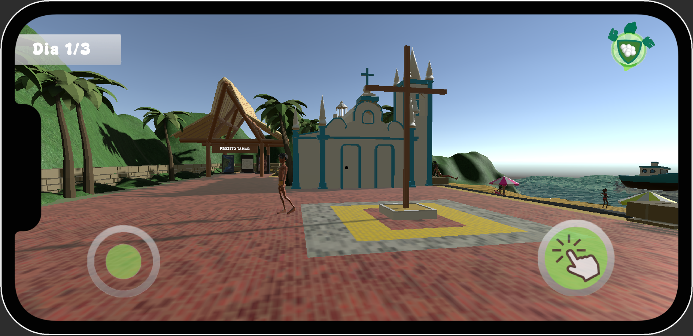
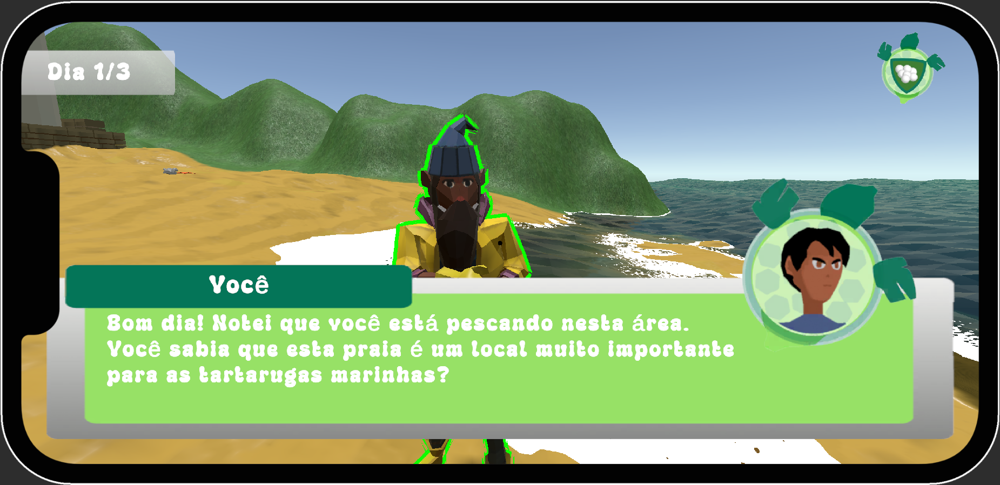
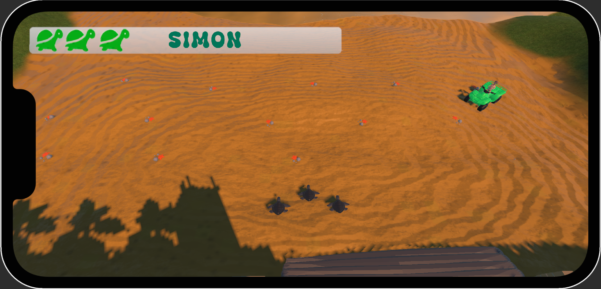
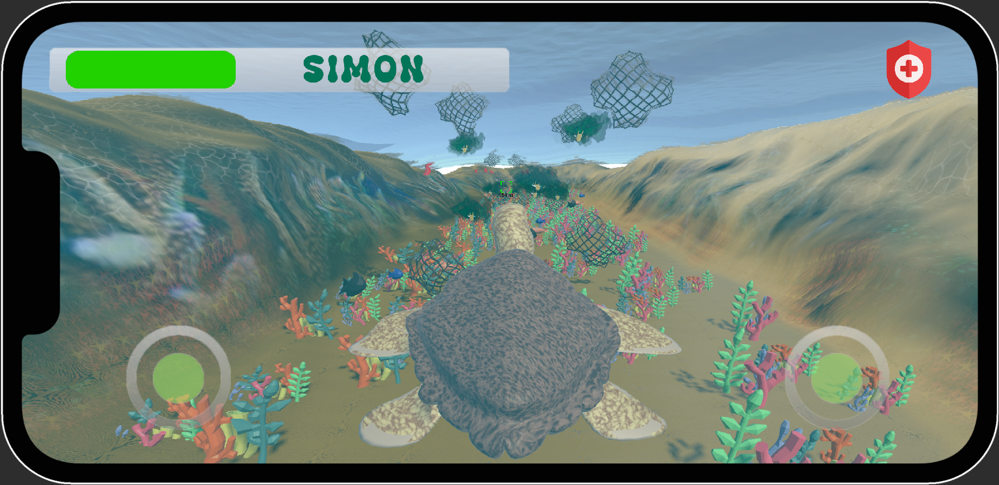

# Casquinha do Mar

Em *Casquinha do Mar*, você assume o papel de um pesquisador recém-contratado pelo Projeto Tamar. Sua missão é proteger tartarugas marinhas desde a desova dos ovos até a fase adulta. Enfrente desafios, conscientize pessoas e explore as maravilhas da vida marinha em uma jornada que une preservação ambiental, ação e aventura.

## Objetivo do desenvolvimento do jogo

“Casquinha do Mar” é um jogo que destaca a **importância da conservação ambiental e educação sobre a vida marinha**, com parceria do [Projeto Tamar](https://www.tamar.org.br/). O jogo coloca o jogador na pele de um pesquisador que assume a responsabilidade de proteger e guiar as tartarugas marinhas em momentos cruciais de suas vidas.

## Imagens do jogo

- **Menu inicial**
  

- **Primeiro Nível: "Proteção dos Ovos"**
  - O jogador assume o papel de um pesquisador que deve cuidar da praia, conscientizar pessoas e proteger os ninhos.

- **Diálogos da Fase 1**
  - Interações com pescadores e turistas que permitem conscientizá-los sobre boas práticas de preservação marinha, destacando políticas públicas e ações individuais que ajudam a proteger as tartarugas e seu habitat.

- **Segundo Nível: "A Caminho do Mar"**
  - O jogador protege os filhotes durante sua jornada da areia até o mar, enfrentando obstáculos como lixo e quadriciclos.

- **Terceiro Nível: "Oceano Aberto"**
  - Controle uma tartaruga adulta, enfrentando ameaças como redes fantasmas e poluição enquanto busca sua área de reprodução.

- **Créditos**
  - Todos os desenvolvedores e orientadores do projeto.

## Tecnologias utilizadas

- **Unity (Game Engine)**
- **Blender (Software para criação de modelagens e animações 3D)**
- **Adobe Illustrator (Software de criação de artes)**
